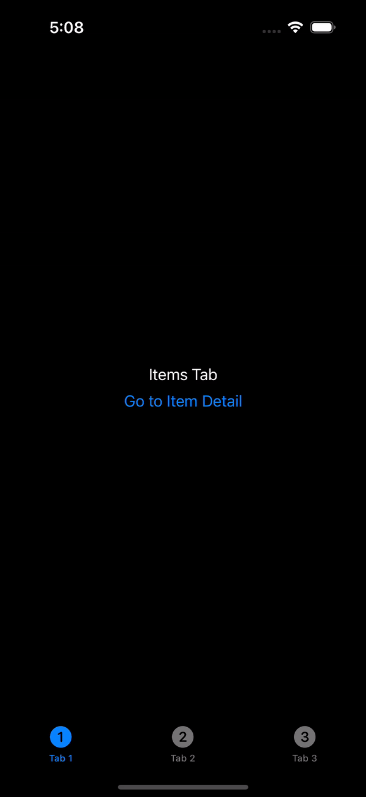

# FlowCoordinator-SwiftUI
Simple, powerful and elegant implementation of the Coordinator pattern in SwiftUI using new API NavigationStack. 

# What is Coordinator?
In navigation, particularly in iOS development, a coordinator is a design pattern used to manage navigation logic in an organized and decoupled way. Instead of handling navigation within individual views, the coordinator acts as an intermediary responsible for pushing and presenting views, managing the flow of the app, and sometimes handling dependencies between screens.

# About the project

## Defining the Coordinator Protocol
This protocol set the default navigation stack array and a function to navigate to any specific step

```swift
protocol Coordinator: ObservableObject {
    associatedtype CoordinatorSteps: Steps
    associatedtype CoordinatorView: View

    var path: [CoordinatorSteps] { get set }

    func redirect(_ path: CoordinatorSteps) -> CoordinatorView
}
```
## Navigation step protocol
This is base protocol for defining steps for each flow
```swift
protocol Steps: Equatable, Hashable {}
```

## Navigation Modifier
This is a modifier that uses NavigationStack to navigate the view to any specific screen.

```swift
struct NavigationSetupModifier<CoordinatorType: Coordinator>: ViewModifier {
    @ObservedObject var coordinator: CoordinatorType

    func body(content: Content) -> some View {
        NavigationStack(path: $coordinator.path) {
            content
                .navigationDestination(for: CoordinatorType.CoordinatorSteps.self) { step in
                    debugPrint("navigate to: \(step)")
                    return coordinator.redirect(step)
                }
        }
    }
}

extension View {
    func applyNavigation<CoordinatorType: Coordinator>(coordinator: CoordinatorType) -> some View {
        self.modifier(NavigationSetupModifier(coordinator: coordinator))
    }
}
```

Example code to use this modifier
```swift
    var body: some View {
        VStack {
            Button("Go to Item Detail") {
                // viewModel.coordinator.navigateToDetail()
            }
        }
        .applyNavigation(coordinator: viewModel.coordinator)
    }

```

# Example
This sample application contains several screen inclucding tab bar to cover adding multiple coordinators as an example of eCommerce application.

- Tab bar view
- Wallet and detail screens
- Profile screen
- Add to card screen
- Select payment method screen
- Buy item screen
- Purchase Summary screen


